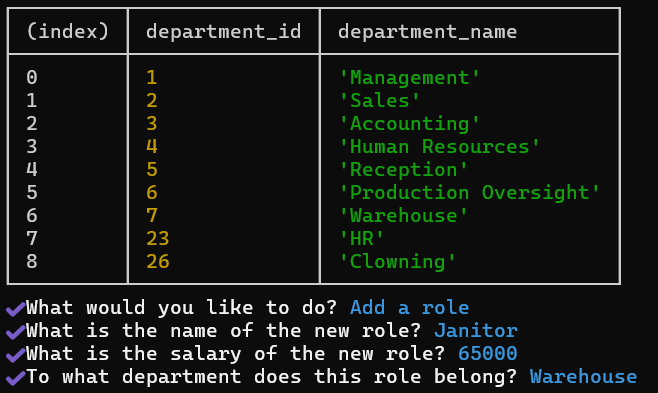
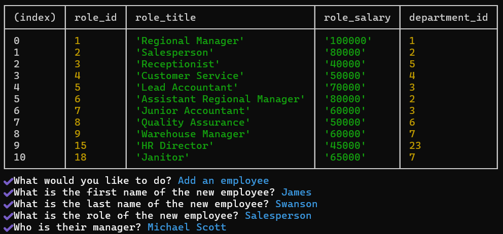
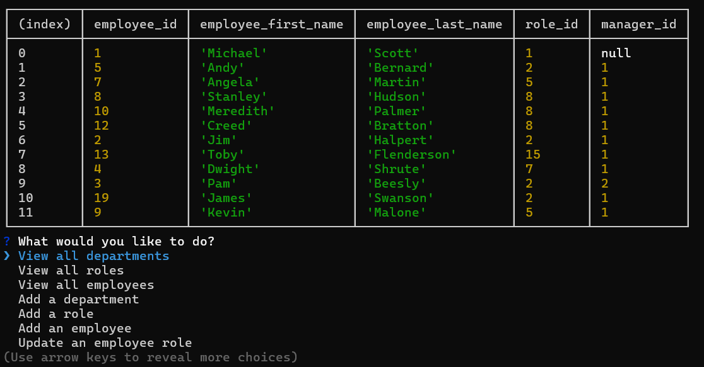

  https://opensource.org/license/mit
# Module 10 Challenge - Employee Tracker II - The SQL
## Description
This challenge uses Inquirer, postgres, & node.js to allow users to create and edit an employee tracker through the command line.
## Table of Contents
* [Installation](#installation)
* [Usage](#usage)
* [Credits](#credits)
* [License](#license)
* [Features](#features)
* [Contributing](#contributing)
## Installation
In order to run it from the command line, postres, Inquirer, & dotenv need to be installed for full functionality.
## Usage
Navigate to the relevant directory on the command line and initiate by typing 'node.js'. You'll then be presented with a series of options that allow you to modify three tables - the list of departments, roles, & employees. A demonstration video is included below in addition to some sample screenshots.
Sample Video:
https://drive.google.com/file/d/1kgJ9gBOfZrpds3kMr0jfswFvE172xuca/view

Sample Screenshots:

## Credits
This project was created from scratch by James Swanson, but certain functions had the assistance of various coding tutors & TAs.
## License
This project is licensed under the terms of the MIT License.
## Features
There are a couple of optional incomplete features - calculating the total budget of a department, viewing managers, viewing managers by employee. For better user experience I may add columns that include names of managers, roles, & departments rather than simply their ids. This prevents having to double check which id corresponds to which component.
## Contributing
You can download the GitHub repo and contribute locally!
## Questions
Have questions? Visit [my GitHub profile](https://github.com/Majexs) and [my email](mailto:majexs@gmail.com).